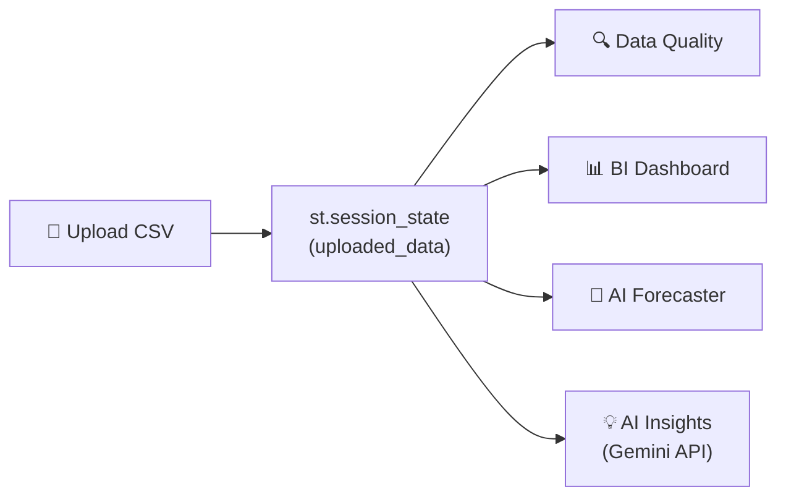
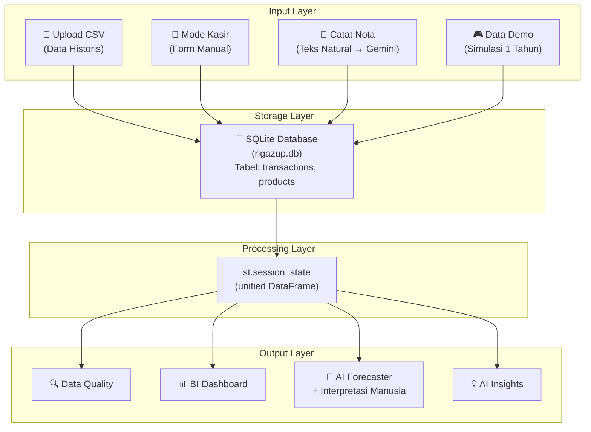
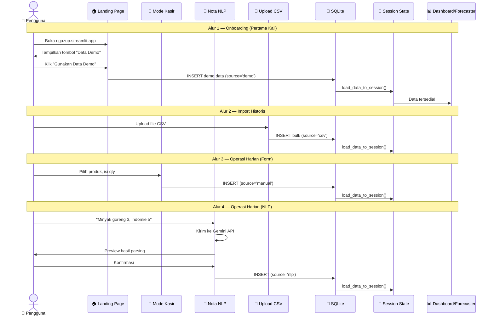

# 📦 PRD: RIGAZUP v2.0 — Update & Fitur Baru

> **Product:** RIGAZUP — ML-Powered Smart Inventory Planner for MSMEs
> **Live App:** https://rigazup.streamlit.app
> **Repository:** https://github.com/Group7-DSGA-Celerates/rigazup-finalproject-celerates
> **Pengembang:** Rian Sholihan (NIM: 23051204384) — S1 Teknik Informatika, Fakultas Teknik, Universitas Negeri Surabaya
> **Tanggal PRD:** 15 Juli 2026
> **Versi:** 2.0

---

## 1. Ringkasan Eksekutif

RIGAZUP v2.0 adalah pembaruan major yang mentransformasi aplikasi dari sebuah *proof-of-concept* menjadi **alat operasional harian** yang siap digunakan oleh pemilik UMKM. Update ini berfokus pada 5 area utama:

| # | Fitur | Prioritas | Dampak |
|---|---|---|---|
| 1 | Mode Kasir / Input Transaksi Harian | 🔴 Utama | Menghilangkan ketergantungan pada CSV untuk operasional harian |
| 2 | Catat Nota via Teks Natural (Gemini AI) | 🟠 Tinggi | *Killer feature* — input transaksi pakai bahasa sehari-hari |
| 3 | Tombol "Gunakan Data Demo" | 🟡 Sedang | Onboarding instan untuk pengguna baru |
| 4 | Interpretasi Model yang Manusiawi | 🟡 Sedang | Metrik ML diterjemahkan ke bahasa bisnis |
| 5 | Rebranding "About RIGAZUP" | 🟢 Rendah | Update kredit pengembang |

---

## 2. Arsitektur Sistem Saat Ini (AS-IS)



> [!WARNING]
> **Masalah Utama Arsitektur Saat Ini:**
> - **Satu-satunya pintu masuk data** adalah upload CSV — tidak ada cara input manual
> - **Tidak ada persistent storage** — data hilang saat refresh halaman
> - **Tidak ada data demo** — pengguna baru melihat halaman kosong
> - **Metrik ML mentah** — MAE, RMSE, R² tanpa penjelasan bisnis
> - Semua data hanya hidup di `st.session_state`

### File & Struktur Saat Ini

| File | Fungsi | Status |
|---|---|---|
| [app.py](https://github.com/Group7-DSGA-Celerates/rigazup-finalproject-celerates/blob/main/app.py) | Entry point, navigasi 7 halaman | ✏️ Modifikasi |
| [src/overview.py](https://github.com/Group7-DSGA-Celerates/rigazup-finalproject-celerates/blob/main/src/overview.py) | Landing page | ✏️ Modifikasi |
| [pages/1_Upload_Dataset.py](https://github.com/Group7-DSGA-Celerates/rigazup-finalproject-celerates/blob/main/pages/1_Upload_Dataset.py) | Upload CSV | ✏️ Modifikasi |
| [pages/2_Data_Quality.py](https://github.com/Group7-DSGA-Celerates/rigazup-finalproject-celerates/blob/main/pages/2_Data_Quality.py) | Cek kualitas data | Tetap |
| [pages/3_BI_Dashboard.py](https://github.com/Group7-DSGA-Celerates/rigazup-finalproject-celerates/blob/main/pages/3_BI_Dashboard.py) | Dashboard BI | Tetap |
| [pages/4_AI_Forecaster.py](https://github.com/Group7-DSGA-Celerates/rigazup-finalproject-celerates/blob/main/pages/4_AI_Forecaster.py) | Forecasting ML & reorder point | ✏️ Modifikasi |
| [pages/5_AI_Insights.py](https://github.com/Group7-DSGA-Celerates/rigazup-finalproject-celerates/blob/main/pages/5_AI_Insights.py) | AI Insights via Gemini | Tetap |
| [pages/6_About.py](https://github.com/Group7-DSGA-Celerates/rigazup-finalproject-celerates/blob/main/pages/6_About.py) | About Project | ✏️ Modifikasi |

### Kolom Data yang Digunakan

```
date           → Format: YYYY-MM-DD
product_name   → Nama produk (string)
quantity_sold  → Jumlah terjual (integer)
unit_price     → Harga satuan (float/integer)
```

### Integrasi Gemini API Saat Ini

- **Package:** `google-generativeai`
- **Model:** `gemini-pro`
- **API Key:** Environment variable `GEMINI_API_KEY` atau `st.secrets["GEMINI_API_KEY"]`
- **Digunakan di:** `pages/5_AI_Insights.py` untuk analisis tren & rekomendasi

---

## 3. Arsitektur Sistem Target (TO-BE)



> [!IMPORTANT]
> **Perubahan Arsitektur Kunci:**
> 1. Semua input (CSV, form, NLP, demo) mengalir ke **SQLite** sebagai single source of truth
> 2. `st.session_state` tetap digunakan, tapi di-*populate* dari database
> 3. Data **persisten** — tidak hilang saat refresh
> 4. SQLite ringan dan kompatibel dengan Streamlit Cloud

---

## 4. Spesifikasi Fitur Detail

---

### 4.1 🔴 FITUR 1: Mode Kasir / Input Transaksi Harian

#### 4.1.1 Deskripsi
Halaman form manual bernama **"Input Penjualan Baru"** yang memungkinkan pengguna mencatat transaksi harian tanpa harus membuat/mengedit file CSV. Ini menjadi workflow utama untuk operasional sehari-hari, sementara CSV tetap tersedia untuk import data historis.

#### 4.1.2 User Story
> *Sebagai pemilik toko kelontong, saya ingin mencatat setiap transaksi penjualan dengan klik-klik sederhana, sehingga stok dan reorder point otomatis terupdate tanpa harus repot membuka Excel.*

#### 4.1.3 Komponen UI

```
┌─────────────────────────────────────────────────┐
│  🧾 Input Penjualan Baru                        │
│                                                   │
│  📅 Tanggal: [Date Picker — default: hari ini]   │
│                                                   │
│  📦 Produk:  [▼ Selectbox: daftar produk]        │
│              [+ Tambah Produk Baru ...]           │
│                                                   │
│  🔢 Jumlah:  [Number Input — min: 1]             │
│                                                   │
│  💰 Harga Satuan: [Number Input — auto-fill]     │
│                                                   │
│  [ 💾 Simpan Transaksi ]                          │
│                                                   │
│  ─────────────────────────────────────────────    │
│  📋 Riwayat Transaksi Hari Ini                   │
│  ┌──────┬──────────┬─────┬───────┬───────┐       │
│  │ No   │ Produk   │ Qty │ Harga │ Total │       │
│  ├──────┼──────────┼─────┼───────┼───────┤       │
│  │ 1    │ Indomie  │ 5   │ 3.500 │17.500 │       │
│  │ 2    │ Minyak   │ 3   │18.000 │54.000 │       │
│  └──────┴──────────┴─────┴───────┴───────┘       │
│                                                   │
│  📊 Total Hari Ini: Rp 71.500 (8 item)           │
└─────────────────────────────────────────────────┘
```

#### 4.1.4 Spesifikasi Teknis

**File Baru:** `pages/1B_Input_Penjualan.py`

**Komponen Streamlit:**
| Komponen | Widget | Detail |
|---|---|---|
| Tanggal | `st.date_input()` | Default: `datetime.today()` |
| Pilih Produk | `st.selectbox()` | Sumber: tabel `products` di SQLite |
| Tambah Produk Baru | `st.text_input()` + `st.number_input()` | Muncul via `st.expander` |
| Jumlah Barang | `st.number_input()` | `min_value=1, step=1` |
| Harga Satuan | `st.number_input()` | Auto-fill dari produk, bisa di-override |
| Tombol Simpan | `st.form_submit_button()` | Di dalam `st.form("input_transaksi")` |

**Database (SQLite):**

```sql
-- Tabel produk (master data)
CREATE TABLE IF NOT EXISTS products (
    id INTEGER PRIMARY KEY AUTOINCREMENT,
    product_name TEXT UNIQUE NOT NULL,
    default_price REAL NOT NULL,
    created_at TIMESTAMP DEFAULT CURRENT_TIMESTAMP
);

-- Tabel transaksi (log penjualan)
CREATE TABLE IF NOT EXISTS transactions (
    id INTEGER PRIMARY KEY AUTOINCREMENT,
    date TEXT NOT NULL,              -- Format: YYYY-MM-DD
    product_name TEXT NOT NULL,
    quantity_sold INTEGER NOT NULL,
    unit_price REAL NOT NULL,
    source TEXT DEFAULT 'manual',    -- 'manual', 'csv', 'nlp', 'demo'
    created_at TIMESTAMP DEFAULT CURRENT_TIMESTAMP,
    FOREIGN KEY (product_name) REFERENCES products(product_name)
);
```

**Modul Baru:** `src/database.py`

```python
# Fungsi-fungsi utama:
def init_db()                           # Buat tabel jika belum ada
def insert_transaction(date, product, qty, price, source)
def insert_bulk_transactions(df, source)  # Untuk CSV/demo import
def get_all_transactions() -> pd.DataFrame
def get_products() -> list
def add_product(name, price)
def get_today_transactions() -> pd.DataFrame
def load_data_to_session()              # Populate st.session_state['uploaded_data']
```

**Alur Kerja:**
1. User membuka halaman "Input Penjualan Baru"
2. Pilih produk dari dropdown (atau tambah baru)
3. Isi jumlah dan harga
4. Klik "Simpan Transaksi"
5. Data masuk ke SQLite → `load_data_to_session()` dipanggil
6. Semua halaman lain (Dashboard, Forecaster, dll.) otomatis membaca data terbaru
7. Riwayat transaksi hari ini ditampilkan di bawah form

#### 4.1.5 Validasi & Error Handling
- Produk harus dipilih (tidak boleh kosong)
- Jumlah minimal 1
- Harga minimal > 0
- Tanggal tidak boleh di masa depan
- Duplikasi produk di master data → ditolak dengan pesan jelas
- Feedback: `st.success("✅ Transaksi tersimpan!")` + balloons

---

### 4.2 🟠 FITUR 2: Catat Nota via Teks Natural (Gemini AI)

#### 4.2.1 Deskripsi
Fitur **"Catat Nota Cepat"** yang memanfaatkan Gemini API untuk mengekstrak data transaksi dari teks bahasa Indonesia yang tidak beraturan. Ini adalah *killer feature* yang membuat RIGAZUP unik — kasir tinggal mengetik seperti menulis pesan WhatsApp.

#### 4.2.2 User Story
> *Sebagai kasir yang sibuk, saya ingin mencatat penjualan dengan mengetik kalimat biasa seperti "minyak goreng laku 3, indomie 5 biji, beras 5kg dibeli 2 karung", tanpa perlu mengisi form satu-satu.*

#### 4.2.3 Komponen UI

```
┌─────────────────────────────────────────────────┐
│  💬 Catat Nota Cepat (AI-Powered)                │
│                                                   │
│  Ketik nota penjualan Anda dengan bahasa bebas:  │
│  ┌─────────────────────────────────────────────┐ │
│  │ Minyak goreng laku 3, indomie dibeli orang  │ │
│  │ 5 biji, sabun mandi 2                       │ │
│  └─────────────────────────────────────────────┘ │
│                                                   │
│  [ 🤖 Proses dengan AI ]                         │
│                                                   │
│  ─── Hasil Parsing AI ──────────────────────      │
│                                                   │
│  ✅ Berhasil mengekstrak 3 item:                  │
│  ┌──────────────┬─────┬──────────┐               │
│  │ Produk       │ Qty │ Harga    │               │
│  ├──────────────┼─────┼──────────┤               │
│  │ Minyak Gorenng│ 3   │ 18.000  │  ← auto-match│
│  │ Indomie      │ 5   │ 3.500   │  ← auto-match │
│  │ Sabun Mandi  │ 2   │ ⚠️ ???  │  ← perlu input│
│  └──────────────┴─────┴──────────┘               │
│                                                   │
│  ⚠️ "Sabun Mandi" belum terdaftar.               │
│     Masukkan harga: [Number Input]               │
│                                                   │
│  [ ✅ Konfirmasi & Simpan Semua ]                 │
└─────────────────────────────────────────────────┘
```

#### 4.2.4 Spesifikasi Teknis

**Ditambahkan di:** `pages/1B_Input_Penjualan.py` (tab atau expander di halaman yang sama)

**Prompt Engineering untuk Gemini:**

```python
EXTRACTION_PROMPT = """
Kamu adalah asisten kasir toko kelontong Indonesia.
Ekstrak teks penjualan berikut menjadi format JSON array.
Setiap item harus memiliki field: "nama_barang" (string, capitalized) dan "quantity" (integer).

ATURAN PENTING:
1. Jika tidak ada angka disebutkan, anggap quantity = 1
2. Abaikan kata-kata seperti "laku", "dibeli orang", "biji", "buah", "karung", "pcs"
3. Normalisasi nama barang (contoh: "mie goreng" → "Indomie Goreng", "migor" → "Minyak Goreng")
4. Jangan tambahkan field lain selain "nama_barang" dan "quantity"
5. Output HANYA JSON array, tanpa penjelasan atau markdown

Teks penjualan:
"{user_input}"
"""
```

**Alur Kerja:**
1. User mengetik teks nota di `st.text_area`
2. Klik "Proses dengan AI"
3. Teks dikirim ke Gemini API dengan prompt di atas
4. Response di-parse sebagai JSON: `json.loads(response.text)`
5. Sistem melakukan **fuzzy matching** nama barang dengan master produk di database
   - Jika match → auto-fill harga dari database
   - Jika tidak match → tandai ⚠️ dan minta user input harga + konfirmasi nama
6. Tampilkan tabel preview hasil parsing dengan `st.data_editor` (bisa diedit user)
7. User klik "Konfirmasi & Simpan" → masuk ke SQLite dengan `source='nlp'`

**Penanganan Error:**
- Gemini mengembalikan format non-JSON → coba parsing ulang, tampilkan error yang ramah
- Nama barang ambigu → tampilkan saran terdekat dari database (fuzzy match dengan `difflib.get_close_matches`)
- API timeout → retry 1x, lalu tampilkan form manual sebagai fallback

**Dependency Tambahan:** Tidak ada — sudah menggunakan `google-generativeai` dan `json` (standard library)

---

### 4.3 🟡 FITUR 3: Tombol "Gunakan Data Demo"

#### 4.3.1 Deskripsi
Tombol mencolok di sidebar dan landing page yang langsung memuat **dataset simulasi penjualan mini market fiktif selama 1 tahun** (365 hari, 15-20 produk, ~5.000+ baris). Pengguna baru bisa langsung melihat dashboard beraksi tanpa perlu menyiapkan file CSV.

#### 4.3.2 User Story
> *Sebagai pengguna baru yang baru membuka link RIGAZUP, saya ingin langsung melihat bagaimana dashboard dan AI forecasting bekerja, tanpa harus menyiapkan data sendiri.*

#### 4.3.3 Komponen UI

**Di Sidebar (selalu tampil):**
```
┌────────────────────┐
│  🎮 MODE DEMO      │
│  ──────────────     │
│  [ 🚀 Gunakan      │
│    Data Simulasi ]  │
│                     │
│  Data fiktif toko   │
│  kelontong 1 tahun  │
└────────────────────┘
```

**Di Landing Page (`src/overview.py`):**
```
┌─────────────────────────────────────────────────┐
│  🎮 Baru pertama kali? Coba langsung!            │
│                                                   │
│  [ 🚀 Gunakan Data Simulasi Demo ]               │
│                                                   │
│  Dataset berisi data penjualan fiktif toko        │
│  kelontong selama 1 tahun (2024-2025).           │
│  Anda bisa langsung mencoba semua fitur!          │
└─────────────────────────────────────────────────┘
```

#### 4.3.4 Spesifikasi Teknis

**File Data Demo Baru:** `data/demo_sales_data.csv`

**Konten Demo Dataset:**
- **Periode:** 1 Januari 2024 — 31 Desember 2024
- **Jumlah Produk:** 15 produk khas toko kelontong Indonesia
- **Total Baris:** ~5.000-6.000 transaksi
- **Variasi realistis:** tren musiman (Ramadan, Natal), weekend spike, variasi harga

**Produk Demo:**

| # | Nama Produk | Harga Satuan | Rata-rata Harian |
|---|---|---|---|
| 1 | Indomie Goreng | 3.500 | 8-15 |
| 2 | Minyak Goreng Bimoli 1L | 18.000 | 3-7 |
| 3 | Beras Premium 5kg | 65.000 | 2-4 |
| 4 | Gula Pasir 1kg | 15.000 | 3-6 |
| 5 | Kopi Kapal Api Sachet | 1.500 | 10-20 |
| 6 | Sabun Mandi Lifebuoy | 4.500 | 3-8 |
| 7 | Deterjen Rinso 800g | 12.000 | 2-5 |
| 8 | Air Mineral Aqua 600ml | 3.000 | 15-25 |
| 9 | Teh Pucuk Harum 350ml | 4.000 | 8-15 |
| 10 | Rokok Gudang Garam | 28.000 | 5-12 |
| 11 | Telur Ayam (butir) | 2.500 | 10-20 |
| 12 | Susu Ultra Milk 250ml | 5.500 | 5-10 |
| 13 | Roti Tawar Sari Roti | 15.000 | 2-5 |
| 14 | Mie Sedaap Goreng | 3.200 | 6-12 |
| 15 | Sambal ABC Sachet | 2.000 | 8-15 |

**Script Generator:** `src/generate_demo_data.py`

```python
# Pseudocode
import pandas as pd
import numpy as np

def generate_demo_data():
    """Generate 1 year of realistic sales data for a fictional mini market."""
    products = { ... }  # dict of product_name → unit_price
    dates = pd.date_range('2024-01-01', '2024-12-31')
    
    records = []
    for date in dates:
        for product, price in products.items():
            # Base demand with seasonal factors
            base = np.random.poisson(lam=avg_demand[product])
            
            # Ramadan boost for food items (March-April 2024)
            # Weekend boost (+20%)
            # Year-end boost (December)
            
            if base > 0:
                records.append({
                    'date': date.strftime('%Y-%m-%d'),
                    'product_name': product,
                    'quantity_sold': base,
                    'unit_price': price
                })
    
    return pd.DataFrame(records)
```

**Alur Kerja:**
1. User klik "Gunakan Data Simulasi Demo"
2. Baca `data/demo_sales_data.csv`
3. Import ke SQLite dengan `source='demo'`
4. Panggil `load_data_to_session()`
5. Tampilkan `st.success("🎮 Data demo berhasil dimuat! ...")` + redirect/rerun
6. Semua halaman langsung menampilkan data

**Pengamanan:**
- Jika sudah ada data real → tampilkan `st.warning("⚠️ Memuat data demo akan menghapus data saat ini. Lanjutkan?")` + tombol konfirmasi
- Data demo diberi flag `source='demo'` agar bisa dibedakan dari data real

---

### 4.4 🟡 FITUR 4: Interpretasi Model yang Manusiawi

#### 4.4.1 Deskripsi
Menambahkan **penjelasan dalam bahasa bisnis** di bawah setiap metrik evaluasi model (MAE, RMSE, R²). Metrik ilmiah tetap ditampilkan, tetapi dilengkapi dengan interpretasi yang mudah dipahami pemilik UMKM.

#### 4.4.2 User Story
> *Sebagai pemilik toko yang bukan data scientist, saya ingin memahami apa artinya "MAE = 2.3" dalam konteks bisnis saya, tanpa harus Googling istilah statistik.*

#### 4.4.3 Komponen UI

**SEBELUM (AS-IS):**
```
┌──────────────────────────────────┐
│ Model Comparison                  │
│ ┌───────────┬──────┬──────┬────┐ │
│ │ Model     │ MAE  │ RMSE │ R² │ │
│ ├───────────┼──────┼──────┼────┤ │
│ │ XGBoost   │ 1.8  │ 2.3  │0.94│ │
│ │ RF        │ 2.1  │ 2.7  │0.91│ │
│ │ ...       │ ...  │ ...  │... │ │
│ └───────────┴──────┴──────┴────┘ │
└──────────────────────────────────┘
```

**SESUDAH (TO-BE):**
```
┌──────────────────────────────────────────────────┐
│ 🏆 Model Terbaik: XGBoost                        │
│                                                   │
│ ┌───────────┬──────┬──────┬──────┬──────────────┐│
│ │ Model     │ MAE  │ RMSE │ R²   │ Akurasi     ││
│ ├───────────┼──────┼──────┼──────┼──────────────┤│
│ │ XGBoost ⭐│ 1.8  │ 2.3  │ 0.94 │ ████████ 94%││
│ │ RF        │ 2.1  │ 2.7  │ 0.91 │ ███████░ 91%││
│ │ ...       │ ...  │ ...  │ ...  │ ...         ││
│ └───────────┴──────┴──────┴──────┴──────────────┘│
│                                                   │
│ 💡 Apa Artinya?                                   │
│ ┌─────────────────────────────────────────────┐  │
│ │ "Model XGBoost mendominasi dengan tingkat    │  │
│ │  akurasi 94%. Artinya, prediksi meleset      │  │
│ │  maksimal hanya sekitar 2 unit barang dari   │  │
│ │  permintaan asli. Untuk produk 'Indomie      │  │
│ │  Goreng' yang rata-rata terjual 12/hari,     │  │
│ │  prediksi akan berkisar 10-14 unit — cukup   │  │
│ │  akurat untuk perencanaan stok harian."      │  │
│ └─────────────────────────────────────────────┘  │
└──────────────────────────────────────────────────┘
```

#### 4.4.4 Spesifikasi Teknis

**Modifikasi di:** `pages/4_AI_Forecaster.py`

**Logika Interpretasi (Python):**

```python
def interpret_model_metrics(best_model_name, mae, rmse, r2, avg_demand, product_name):
    """Generate human-friendly interpretation of model metrics."""
    
    # Hitung akurasi persentase dari R²
    accuracy_pct = max(0, r2 * 100)
    
    # Kategorisasi performa
    if r2 >= 0.90:
        level = "sangat baik"
        emoji = "🟢"
        desc = "sangat akurat"
    elif r2 >= 0.75:
        level = "baik"
        emoji = "🟡"
        desc = "cukup akurat"
    elif r2 >= 0.50:
        level = "cukup"
        emoji = "🟠"
        desc = "masih perlu diperhatikan"
    else:
        level = "kurang"
        emoji = "🔴"
        desc = "perlu lebih banyak data"
    
    interpretation = f"""
    {emoji} **Model {best_model_name}** menunjukkan performa **{level}** 
    dengan tingkat akurasi **{accuracy_pct:.0f}%**.
    
    📊 **Dalam bahasa bisnis:**
    - Prediksi untuk **{product_name}** meleset rata-rata hanya 
      **{mae:.1f} unit** dari permintaan aktual
    - Untuk produk yang rata-rata terjual **{avg_demand:.0f} unit/hari**, 
      prediksi akan berkisar **{max(0, avg_demand-mae):.0f}–{avg_demand+mae:.0f} unit**
    - Tingkat kepercayaan model: **{desc}** untuk perencanaan stok
    """
    return interpretation
```

**Opsi Alternatif — Menggunakan Gemini API:**

Untuk interpretasi yang lebih kaya dan kontekstual, kirim metrik ke Gemini:

```python
INTERPRETATION_PROMPT = """
Kamu adalah konsultan bisnis UMKM Indonesia. Jelaskan hasil evaluasi model ML berikut 
dalam 2-3 kalimat sederhana yang dipahami pemilik toko kelontong. 
Jangan gunakan istilah teknis. Fokus pada dampak bisnis.

Data:
- Model terbaik: {best_model}
- MAE (rata-rata selisih prediksi): {mae:.2f} unit
- Akurasi (R²): {r2:.2%}
- Produk: {product_name}
- Rata-rata penjualan harian: {avg_demand:.0f} unit

Berikan penjelasan singkat dan actionable.
"""
```

> [!TIP]
> **Rekomendasi:** Gunakan logika `if-else` sebagai default (tanpa biaya API), dan sediakan tombol "🤖 Minta Penjelasan AI Lebih Detail" yang memanggil Gemini untuk interpretasi lebih mendalam.

---

### 4.5 🟢 FITUR 5: Rebranding "About RIGAZUP"

#### 4.5.1 Deskripsi
Mengganti halaman "About Project" menjadi **"About RIGAZUP"** dengan pengembang tunggal: **Rian Sholihan (NIM: 23051204384)**, S1 Teknik Informatika, Fakultas Teknik, Universitas Negeri Surabaya. Semua penyebutan "Kelompok 7", "Celerates", "DSGA", dan "CAMP" dihapus.

#### 4.5.2 Perubahan

**Modifikasi di:** `pages/6_About.py` dan `app.py` (judul navigasi)

**Konten Baru:**

```python
st.title("ℹ️ About RIGAZUP")

st.markdown("""
## 📦 RIGAZUP — ML-Powered Smart Inventory Planner

### 📋 Deskripsi Proyek
RIGAZUP adalah aplikasi perencanaan inventaris cerdas berbasis Machine Learning 
yang dirancang khusus untuk UMKM (Usaha Mikro, Kecil, dan Menengah) di Indonesia.
Aplikasi ini membantu pemilik bisnis mengelola stok barang secara otomatis 
menggunakan prediksi AI dan memberikan rekomendasi reorder point yang optimal.

### 👨‍💻 Pengembang
| Nama | NIM | Program Studi | Fakultas | Universitas |
|---|---|---|---|---|
| **Rian Sholihan** | 23051204384 | S1 Teknik Informatika | Fakultas Teknik | Universitas Negeri Surabaya |

### ✨ Fitur Utama
- 📂 Upload data historis via CSV
- 🧾 Mode kasir untuk input transaksi harian
- 💬 Catat nota cepat dengan bahasa natural (AI-powered)
- 📊 Dashboard Business Intelligence interaktif
- 🤖 AI Forecasting dengan 4 model ML
- 💡 AI Insights menggunakan Google Gemini
- 🎮 Data demo untuk onboarding instan

### 🛠️ Technology Stack
- **Backend:** Python, Pandas, NumPy
- **Frontend:** Streamlit
- **ML:** Scikit-Learn, XGBoost
- **AI:** Google Gemini API
- **Visualisasi:** Plotly
- **Database:** SQLite
""")
```

**Perubahan di `app.py`:**
```diff
- st.Page("pages/6_About.py", title="About Project", icon="ℹ️"),
+ st.Page("pages/6_About.py", title="About RIGAZUP", icon="ℹ️"),
```

**Perubahan di `src/overview.py` (footer):**
```diff
- <p>© 2025 RIGAZUP - Kelompok 7 DSGA Celerates</p>
- <p>Data Science & Generative AI • Final Project</p>
+ <p>© 2025 RIGAZUP — Developed by Rian Sholihan</p>
+ <p>S1 Teknik Informatika • Universitas Negeri Surabaya</p>
```

---

## 5. Perubahan File Lengkap

### File Baru
| File | Deskripsi |
|---|---|
| `src/database.py` | Modul SQLite — init, CRUD, load to session |
| `pages/1B_Input_Penjualan.py` | Halaman Mode Kasir + Catat Nota NLP |
| `data/demo_sales_data.csv` | Dataset demo 1 tahun (~5.000 baris) |
| `src/generate_demo_data.py` | Script generator untuk data demo |

### File Dimodifikasi
| File | Perubahan |
|---|---|
| `app.py` | Tambah navigasi halaman baru, init database, ubah judul "About" |
| `src/overview.py` | Tambah tombol "Data Demo", update footer pengembang |
| `pages/1_Upload_Dataset.py` | Tambah integrasi SQLite (insert CSV ke DB), tambah tombol demo |
| `pages/4_AI_Forecaster.py` | Tambah interpretasi model manusiawi |
| `pages/6_About.py` | Rebranding ke "About RIGAZUP", update pengembang |
| `requirements.txt` | Tidak ada dependency baru (sqlite3 sudah built-in Python) |

---

## 6. Navigasi Baru

```python
pages = {
    "Menu Utama": [
        st.Page("src/overview.py", title="RIGAZUP", icon="🏠", default=True),
        st.Page("pages/1_Upload_Dataset.py", title="Upload Data Historis", icon="📂"),
        st.Page("pages/1B_Input_Penjualan.py", title="Input Penjualan Baru", icon="🧾"),
        st.Page("pages/2_Data_Quality.py", title="Data Quality", icon="🔍"),
        st.Page("pages/3_BI_Dashboard.py", title="BI Dashboard", icon="📊"),
        st.Page("pages/4_AI_Forecaster.py", title="AI Forecaster", icon="🤖"),
        st.Page("pages/5_AI_Insights.py", title="AI Insights", icon="💡"),
        st.Page("pages/6_About.py", title="About RIGAZUP", icon="ℹ️"),
    ]
}
```

---

## 7. Alur Data Baru (Data Flow)



---

## 8. Dependensi & Kompatibilitas

| Package | Versi | Status | Catatan |
|---|---|---|---|
| `streamlit` | ≥1.36.0 | Sudah ada | Untuk `st.navigation` |
| `pandas` | Latest | Sudah ada | |
| `numpy` | Latest | Sudah ada | |
| `scikit-learn` | Latest | Sudah ada | |
| `xgboost` | Latest | Sudah ada | |
| `plotly` | Latest | Sudah ada | |
| `google-generativeai` | Latest | Sudah ada | Untuk Gemini API |
| `sqlite3` | Built-in | Bawaan Python | **Tidak perlu install** |
| `json` | Built-in | Bawaan Python | Untuk parsing response Gemini |
| `difflib` | Built-in | Bawaan Python | Untuk fuzzy matching nama produk |

> [!NOTE]
> **Tidak ada dependency baru** yang perlu ditambahkan ke `requirements.txt`. Semua modul tambahan (`sqlite3`, `json`, `difflib`) sudah termasuk dalam Python standard library.

---

## 9. Pertimbangan Deployment (Streamlit Cloud)

| Aspek | Detail |
|---|---|
| **SQLite di Streamlit Cloud** | SQLite bekerja di Streamlit Cloud, tapi filesystem bersifat *ephemeral* — data akan hilang saat app restart/sleep. Solusi: gunakan path di working directory (`./rigazup.db`) dan sertakan data demo sebagai fallback. |
| **Gemini API Key** | Tetap disimpan di `st.secrets` (file `.streamlit/secrets.toml` di Streamlit Cloud dashboard). |
| **File Size** | Dataset demo ~500KB (CSV) — well within GitHub limits. |
| **Cold Start** | Database otomatis di-init saat pertama kali app dijalankan via `init_db()` di `app.py`. |

> [!IMPORTANT]
> **Limitasi Streamlit Cloud:** Karena filesystem ephemeral, data yang diinput user via form/NLP akan hilang saat app sleep (setelah ~7 hari tidak ada traffic). Untuk workaround:
> 1. **Jangka pendek:** Sediakan tombol "Export Data ke CSV" agar user bisa backup data mereka
> 2. **Jangka panjang (v3.0):** Migrasi ke cloud database (Supabase, PlanetScale, atau Google Cloud SQL)

---

## 10. Rencana Verifikasi

### Automated Testing
```bash
# Test database module
python -m pytest tests/test_database.py

# Test demo data generation
python src/generate_demo_data.py  # Verify output CSV

# Run Streamlit app locally
streamlit run app.py
```

### Manual Verification Checklist
- [ ] Buka app → landing page menampilkan tombol "Data Demo"
- [ ] Klik "Data Demo" → dashboard terisi data
- [ ] Navigasi ke "Input Penjualan Baru" → form muncul lengkap
- [ ] Isi form → klik Simpan → data muncul di riwayat hari ini
- [ ] Ketik nota di fitur NLP → Gemini parsing berhasil → preview muncul
- [ ] Konfirmasi NLP → data masuk ke database
- [ ] Upload CSV → data historis masuk dan merge dengan data existing
- [ ] Dashboard BI → semua chart menampilkan data gabungan
- [ ] AI Forecaster → interpretasi manusiawi muncul di bawah metrik
- [ ] About RIGAZUP → hanya menampilkan Rian Sholihan
- [ ] Refresh halaman → data tetap ada (dari SQLite)
- [ ] Export CSV → file terdownload dengan benar

---

## User Review Required

> [!IMPORTANT]
> **Keputusan Desain yang Perlu Persetujuan:**
>
> 1. **SQLite vs File CSV sebagai storage:** PRD ini mengusulkan SQLite sebagai persistent storage. Alternatifnya adalah append-only CSV lokal (lebih sederhana tapi kurang reliable). Apakah SQLite sudah tepat?
>
> 2. **Fitur NLP di halaman terpisah atau di halaman yang sama dengan Mode Kasir?** PRD ini mengusulkan keduanya di satu halaman (`1B_Input_Penjualan.py`) menggunakan tab/expander. Apakah lebih baik dipisah?
>
> 3. **Ephemeral storage di Streamlit Cloud:** Data user akan hilang saat app sleep. Apakah cukup dengan tombol "Export CSV" sebagai workaround, atau perlu solusi cloud database sekarang?
>
> 4. **Model Gemini:** Saat ini menggunakan `gemini-pro`. Apakah ingin upgrade ke model yang lebih baru (misal `gemini-1.5-flash` atau `gemini-2.0-flash`) untuk performa yang lebih baik?
