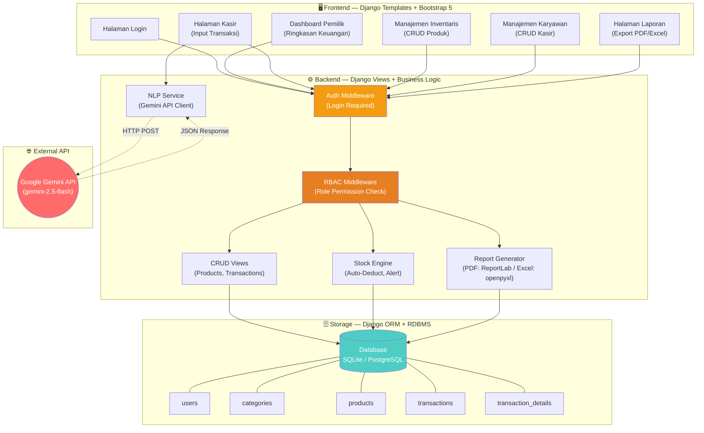
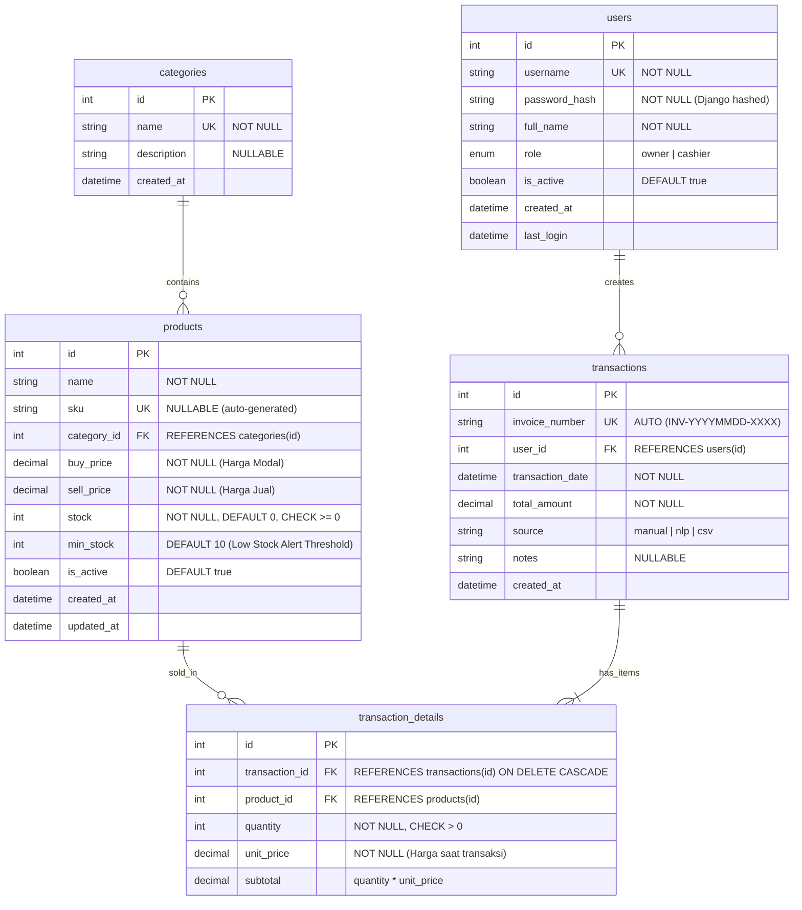
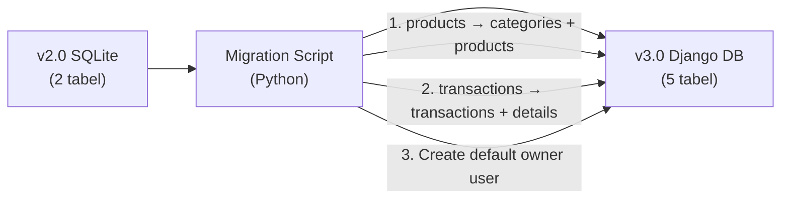
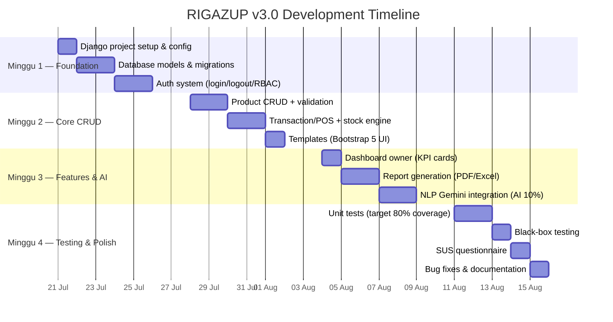

# 📦 PRD: RIGAZUP v3.0 — Enterprise RPL Edition

> **Produk:** RIGAZUP — Sistem Informasi Point of Sales (POS) dan Manajemen Inventaris Berbasis Web  
> **Komposisi Target:** 90% Rekayasa Perangkat Lunak (RPL) | 10% Kecerdasan Buatan (AI)  
> **Pengembang:** Rian Sholihan (NIM: 23051204384) — S1 Teknik Informatika, Universitas Negeri Surabaya  
> **Versi:** 3.0 (Migrasi Arsitektur ke Django MVT)  
> **Tanggal PRD:** 17 Juli 2026

---

## 1. Ringkasan Eksekutif

RIGAZUP v3.0 adalah perombakan arsitektural berskala besar (*Major Refactor*) dari aplikasi analitik berbasis **Streamlit** (v2.0) menjadi **Sistem Perangkat Lunak Skala Industri** (*Production-Ready*) berbasis **Django**. Pembaruan ini menggeser fokus dari Data Science/ML menjadi **90% penguatan Rekayasa Perangkat Lunak** — mencakup arsitektur MVT, keamanan RBAC, database relasional ternormalisasi, RESTful API, pengujian otomatis, dan praktik *Clean Code* — dengan **10% integrasi AI** sebagai fitur penunjang produktivitas kasir.

### Mengapa Migrasi?

RIGAZUP v2.0 (Streamlit) memiliki fondasi ML/DS yang kuat, namun dari perspektif RPL terdapat kelemahan kritis:

| Masalah v2.0 | Dampak | Solusi v3.0 |
|---|---|---|
| Tidak ada sistem login/autentikasi | Siapapun bisa akses semua fitur | RBAC (Owner vs Kasir) dengan Django Auth |
| SQL Injection di `get_today_transactions()` | Kerentanan keamanan | Django ORM (parameterized queries) |
| Database denormalisasi (2 tabel flat) | Integritas data lemah, FK pada TEXT | 5 tabel ternormalisasi, FK pada INTEGER |
| Stok hardcoded = 100 (`load_data_to_session`) | Analisis stok selalu salah | Stok real-time dari tabel `products` |
| Tidak ada test assertions (11 test files kosong) | Zero quality assurance | Django TestCase + pytest + coverage |
| Session state hilang saat refresh browser | Data volatile | Server-side sessions + DB persistence |
| Frontend-backend tightly coupled | Sulit di-maintain dan di-test | MVT separation of concerns |

### Komposisi Disiplin Target (90% RPL)

```
┌────────────────────────────────────────────────────────────────┐
│                                                                │
│   🔧 RPL (Software Engineering)     ██████████████████░░  90%  │
│   🧠 AI (Generative AI / NLP)       ██░░░░░░░░░░░░░░░░░░  10%  │
│                                                                │
└────────────────────────────────────────────────────────────────┘
```

| Komponen RPL | Target % | Cakupan |
|---|:---:|---|
| Arsitektur MVT (Django) | 25% | Models, Views, Templates, URL routing, middleware |
| Database Relasional & ORM | 20% | 5 tabel ternormalisasi, migrations, constraints, indexes |
| Autentikasi & RBAC | 15% | Login/logout, session, role-based permissions, middleware guard |
| Pengujian Perangkat Lunak | 15% | Unit test, integration test, black-box, SUS |
| CRUD & Business Logic | 10% | Manajemen produk, transaksi, pemotongan stok, validasi |
| Pelaporan & Export | 5% | PDF/Excel report generation, template rendering |
| **Subtotal RPL** | **90%** | |
| Integrasi AI (Gemini NLP) | 10% | Catat nota bahasa natural → JSON → auto-fill form kasir |
| **Total** | **100%** | |

---

## 2. Arsitektur Sistem

### 2.1 Perbandingan AS-IS vs TO-BE

| Aspek | ❌ v2.0 (Streamlit) | ✅ v3.0 (Django) |
|---|---|---|
| **Framework** | Streamlit (script-based) | Django 5.x (MVT framework) |
| **Arsitektur** | Monolitik, stateless `st.session_state` | Model-View-Template (MVT) |
| **Frontend** | Streamlit widgets + custom CSS | Django Templates + Bootstrap 5 |
| **Database** | SQLite 2 tabel (denormalisasi) | SQLite (dev) / PostgreSQL (prod), 5 tabel ternormalisasi |
| **Autentikasi** | Tidak ada | Django Auth + RBAC middleware |
| **Keamanan** | SQL injection ada, XSS via `unsafe_allow_html` | ORM parameterized, CSRF protection, XSS escaped |
| **Testing** | 11 file tanpa assertion | Django TestCase + pytest + coverage ≥ 80% |
| **API** | Tidak ada | RESTful internal + Gemini external API |
| **Session** | Browser-only (`st.session_state`) | Server-side sessions (DB-backed) |
| **Deployment** | `streamlit run app.py` (lokal) | `gunicorn` + Nginx (production-ready) |

### 2.2 Diagram Arsitektur v3.0



### 2.3 Struktur Proyek Django

```
rigazup/
├── manage.py
├── rigazup/                        # Project config
│   ├── settings.py                 # Database, auth, middleware config
│   ├── urls.py                     # Root URL routing
│   ├── wsgi.py / asgi.py           # Deployment entry points
│   └── middleware.py               # Custom RBAC middleware
│
├── accounts/                       # Django App: Authentication & RBAC
│   ├── models.py                   # User model (extends AbstractUser, +role field)
│   ├── views.py                    # Login, logout, register views
│   ├── forms.py                    # LoginForm, RegisterForm
│   ├── decorators.py               # @owner_required, @cashier_required
│   ├── urls.py
│   ├── admin.py
│   └── tests.py                    # Auth unit tests
│
├── inventory/                      # Django App: Product & Category CRUD
│   ├── models.py                   # Category, Product models
│   ├── views.py                    # CRUD views (list, create, update, delete)
│   ├── forms.py                    # ProductForm (with validation)
│   ├── urls.py
│   ├── admin.py
│   └── tests.py                    # Inventory unit tests
│
├── transactions/                   # Django App: POS & Transaction Management
│   ├── models.py                   # Transaction, TransactionDetail models
│   ├── views.py                    # POS view, history view, NLP processing
│   ├── forms.py                    # TransactionForm
│   ├── services/
│   │   ├── stock_engine.py         # Auto-deduct stock, low-stock alert
│   │   ├── nlp_service.py          # Gemini API client (AI 10%)
│   │   └── report_service.py       # PDF/Excel generation
│   ├── urls.py
│   ├── admin.py
│   └── tests.py                    # Transaction + NLP unit tests
│
├── dashboard/                      # Django App: Owner Dashboard & Reports
│   ├── views.py                    # Dashboard analytics, report download
│   ├── urls.py
│   └── tests.py                    # Dashboard unit tests
│
├── templates/                      # Global Django templates
│   ├── base.html                   # Base layout (Bootstrap 5, navbar, sidebar)
│   ├── accounts/
│   │   ├── login.html
│   │   └── register.html
│   ├── inventory/
│   │   ├── product_list.html
│   │   ├── product_form.html
│   │   └── category_list.html
│   ├── transactions/
│   │   ├── pos.html                # Halaman kasir
│   │   ├── history.html
│   │   └── nlp_input.html          # AI nota input
│   └── dashboard/
│       ├── overview.html           # KPI cards, charts
│       └── report.html             # Report preview & download
│
├── static/
│   ├── css/style.css               # Custom CSS (migrated from Streamlit)
│   ├── js/pos.js                   # POS interactivity (cart, auto-calculate)
│   └── img/logo.png
│
├── tests/                          # Integration & E2E tests
│   ├── test_integration.py
│   ├── test_rbac.py
│   └── test_stock_engine.py
│
├── requirements.txt
└── pytest.ini / setup.cfg
```

---

## 3. Skema Database (Entity Relationship Diagram)

### 3.1 ER Diagram



### 3.2 Perubahan dari v2.0

| Aspek | v2.0 (SQLite Flat) | v3.0 (RDBMS Ternormalisasi) |
|---|---|---|
| **Jumlah tabel** | 2 (`products`, `transactions`) | 5 tabel ternormalisasi |
| **Foreign Key** | `TEXT` (product_name) | `INTEGER` (proper FK) |
| **User management** | Tidak ada | Tabel `users` dengan role |
| **Kategori** | Hardcoded `"Umum"` | Tabel `categories` tersendiri |
| **Stok** | Hardcoded `100` | Kolom `stock` real-time di `products`, auto-deduct |
| **Harga Modal** | Dihitung `sell_price × 0.7` | Kolom `buy_price` eksplisit di `products` |
| **Detail transaksi** | Flat (1 row = 1 item) | Header-detail (1 nota = N item) |
| **Invoice number** | Tidak ada | Auto-generated `INV-YYYYMMDD-XXXX` |
| **Constraints** | Tidak ada | `CHECK`, `UNIQUE`, `NOT NULL`, `ON DELETE CASCADE` |
| **Indexes** | Tidak ada | Pada `transaction_date`, `product_name`, `user_id` |

### 3.3 Django Models (Implementasi)

```python
# accounts/models.py
from django.contrib.auth.models import AbstractUser
from django.db import models

class User(AbstractUser):
    class Role(models.TextChoices):
        OWNER = 'owner', 'Pemilik Toko'
        CASHIER = 'cashier', 'Kasir'

    role = models.CharField(max_length=10, choices=Role.choices, default=Role.CASHIER)
    full_name = models.CharField(max_length=150)

# inventory/models.py
class Category(models.Model):
    name = models.CharField(max_length=100, unique=True)
    description = models.TextField(blank=True, null=True)
    created_at = models.DateTimeField(auto_now_add=True)

class Product(models.Model):
    name = models.CharField(max_length=200)
    sku = models.CharField(max_length=50, unique=True, blank=True)
    category = models.ForeignKey(Category, on_delete=models.PROTECT, related_name='products')
    buy_price = models.DecimalField(max_digits=12, decimal_places=2)
    sell_price = models.DecimalField(max_digits=12, decimal_places=2)
    stock = models.PositiveIntegerField(default=0)
    min_stock = models.PositiveIntegerField(default=10)
    is_active = models.BooleanField(default=True)
    created_at = models.DateTimeField(auto_now_add=True)
    updated_at = models.DateTimeField(auto_now=True)

    def clean(self):
        if self.buy_price >= self.sell_price:
            raise ValidationError('Harga modal harus lebih kecil dari harga jual.')

# transactions/models.py
class Transaction(models.Model):
    invoice_number = models.CharField(max_length=20, unique=True, editable=False)
    user = models.ForeignKey(User, on_delete=models.PROTECT)
    transaction_date = models.DateTimeField()
    total_amount = models.DecimalField(max_digits=15, decimal_places=2)
    source = models.CharField(max_length=10, default='manual')
    notes = models.TextField(blank=True, null=True)
    created_at = models.DateTimeField(auto_now_add=True)

class TransactionDetail(models.Model):
    transaction = models.ForeignKey(Transaction, on_delete=models.CASCADE, related_name='details')
    product = models.ForeignKey(Product, on_delete=models.PROTECT)
    quantity = models.PositiveIntegerField()
    unit_price = models.DecimalField(max_digits=12, decimal_places=2)
    subtotal = models.DecimalField(max_digits=15, decimal_places=2)
```

---

## 4. Spesifikasi Fitur (Epics & User Stories)

### 4.1 🔴 [RPL] Arsitektur MVT — Django Migration (25%)

**Deskripsi:** Migrasi seluruh logika aplikasi dari Streamlit (script-based) ke Django MVT (Model-View-Template) dengan separation of concerns yang ketat.

| ID | User Story | Acceptance Criteria |
|:---:|---|---|
| US-01 | Sebagai developer, saya ingin setiap fitur terorganisir dalam Django App terpisah | 4 apps: `accounts`, `inventory`, `transactions`, `dashboard` |
| US-02 | Sebagai developer, saya ingin URL routing yang RESTful dan konsisten | Semua URL mengikuti pola `/app/resource/action/` |
| US-03 | Sebagai developer, saya ingin template inheritance yang DRY | Semua halaman extend `base.html` dengan navbar + sidebar |
| US-04 | Sebagai developer, saya ingin static files terkelola dengan baik | CSS/JS/Images served via `` tag |
| US-05 | Sebagai developer, saya ingin konfigurasi terpisah untuk dev dan production | `settings/base.py`, `settings/dev.py`, `settings/prod.py` |

### 4.2 🔴 [RPL] Autentikasi & RBAC (15%)

**Deskripsi:** Sistem login/logout dan kontrol akses berbasis peran (Role-Based Access Control) menggunakan Django Auth.

| ID | User Story | Acceptance Criteria |
|:---:|---|---|
| US-06 | Sebagai pengguna, saya harus login sebelum mengakses fitur apapun | Redirect ke `/login/` jika belum authenticated |
| US-07 | Sebagai pemilik toko, saya bisa melihat dashboard keuangan (laba/rugi) | Dashboard hanya tampil untuk `role=owner` |
| US-08 | Sebagai pemilik toko, saya bisa menambah/menghapus akun kasir | CRUD karyawan hanya untuk `role=owner` |
| US-09 | Sebagai kasir, saya hanya bisa akses halaman POS dan riwayat transaksi saya | Kasir tidak bisa akses `/dashboard/`, `/inventory/`, `/employees/` |
| US-10 | Sebagai kasir, saya hanya melihat transaksi yang saya buat hari ini | Filter `user_id=current_user` dan `date=today` |
| US-11 | Sebagai pengguna, saya bisa logout dan session saya dihancurkan | Session invalidated, redirect ke login |

**Implementasi RBAC:**

```python
# accounts/decorators.py
from functools import wraps
from django.shortcuts import redirect
from django.contrib import messages

def owner_required(view_func):
    @wraps(view_func)
    def wrapper(request, *args, **kwargs):
        if not request.user.is_authenticated:
            return redirect('accounts:login')
        if request.user.role != 'owner':
            messages.error(request, 'Anda tidak memiliki akses ke halaman ini.')
            return redirect('transactions:pos')
        return view_func(request, *args, **kwargs)
    return wrapper

def cashier_required(view_func):
    @wraps(view_func)
    def wrapper(request, *args, **kwargs):
        if not request.user.is_authenticated:
            return redirect('accounts:login')
        if request.user.role not in ('owner', 'cashier'):
            return redirect('accounts:login')
        return view_func(request, *args, **kwargs)
    return wrapper
```

**Matriks Akses:**

| Halaman | URL | Owner | Kasir | Anonymous |
|---|---|:---:|:---:|:---:|
| Login | `/login/` | ✅ | ✅ | ✅ |
| Dashboard Keuangan | `/dashboard/` | ✅ | ❌ | ❌ |
| Manajemen Produk | `/inventory/` | ✅ | ❌ | ❌ |
| Manajemen Karyawan | `/employees/` | ✅ | ❌ | ❌ |
| Laporan (PDF/Excel) | `/reports/` | ✅ | ❌ | ❌ |
| POS / Kasir | `/pos/` | ✅ | ✅ | ❌ |
| Riwayat Transaksi | `/transactions/` | ✅ (semua) | ✅ (sendiri) | ❌ |
| Catat Nota AI | `/pos/nlp/` | ✅ | ✅ | ❌ |

### 4.3 🔴 [RPL] Database Relasional & ORM (20%)

**Deskripsi:** Migrasi dari 2 tabel flat SQLite ke 5 tabel ternormalisasi dengan constraints, indexes, dan Django ORM.

| ID | User Story | Acceptance Criteria |
|:---:|---|---|
| US-12 | Sebagai developer, saya ingin FK menggunakan INTEGER (bukan TEXT) | Semua relasi melalui `ForeignKey(Model)` |
| US-13 | Sebagai pemilik, saya ingin kategori produk bisa dikelola | CRUD Categories terpisah dari Products |
| US-14 | Sebagai pemilik, saya ingin harga modal (buy_price) diinput manual | Tidak lagi dihitung otomatis `sell_price × 0.7` |
| US-15 | Sebagai pemilik, saya ingin stok berkurang otomatis saat transaksi | `product.stock -= detail.quantity` dalam atomic transaction |
| US-16 | Sebagai pemilik, saya ingin alert jika stok di bawah minimum | Visual badge "Stok Rendah" jika `stock < min_stock` |
| US-17 | Sebagai developer, saya ingin data integrity dijaga oleh DB constraints | `CHECK(stock >= 0)`, `ON DELETE CASCADE/PROTECT`, `UNIQUE` |
| US-18 | Sebagai developer, saya ingin migrations terkelola | `python manage.py makemigrations` + `migrate` |

**Stock Engine (Auto-Deduct):**

```python
# transactions/services/stock_engine.py
from django.db import transaction as db_transaction
from django.core.exceptions import ValidationError
from inventory.models import Product

def process_transaction(transaction_obj, items):
    """
    Atomic transaction: simpan detail + potong stok.
    Jika stok tidak cukup, rollback seluruh transaksi.
    """
    with db_transaction.atomic():
        for item in items:
            product = Product.objects.select_for_update().get(id=item['product_id'])

            if product.stock < item['quantity']:
                raise ValidationError(
                    f'Stok {product.name} tidak cukup. '
                    f'Tersedia: {product.stock}, diminta: {item["quantity"]}'
                )

            product.stock -= item['quantity']
            product.save()

            TransactionDetail.objects.create(
                transaction=transaction_obj,
                product=product,
                quantity=item['quantity'],
                unit_price=product.sell_price,
                subtotal=item['quantity'] * product.sell_price,
            )
```

### 4.4 🟠 [RPL] CRUD & Business Logic (10%)

**Deskripsi:** Operasi Create-Read-Update-Delete untuk produk, kategori, dan transaksi dengan validasi bisnis.

| ID | User Story | Acceptance Criteria |
|:---:|---|---|
| US-19 | Sebagai pemilik, saya bisa menambah produk baru dengan validasi | Form: nama, kategori, harga beli, harga jual, stok awal. Validasi: harga beli < harga jual |
| US-20 | Sebagai pemilik, saya bisa mengedit harga dan stok produk | Update form dengan audit trail (`updated_at`) |
| US-21 | Sebagai pemilik, saya bisa menonaktifkan produk (soft delete) | Set `is_active=False`, produk tidak muncul di POS |
| US-22 | Sebagai kasir, saya bisa membuat transaksi multi-item | Keranjang belanja: pilih produk → qty → auto-hitung subtotal → simpan |
| US-23 | Sebagai kasir, saya bisa melihat riwayat transaksi saya hari ini | Filter by `user_id` dan `date`, tampilkan dengan pagination |
| US-24 | Sebagai pemilik, saya bisa melihat semua transaksi dari semua kasir | Full transaction list dengan filter tanggal, kasir, dan produk |

### 4.5 🟡 [RPL] Pelaporan & Export (5%)

**Deskripsi:** Fitur manajerial untuk mengunduh rekapitulasi data keuangan dalam format PDF dan Excel.

| ID | User Story | Acceptance Criteria |
|:---:|---|---|
| US-25 | Sebagai pemilik, saya bisa download laporan bulanan (PDF) | PDF berisi: total pendapatan, total HPP, laba kotor, top 10 produk |
| US-26 | Sebagai pemilik, saya bisa download data transaksi (Excel) | Excel file dengan filter tanggal, sheet per kategori |
| US-27 | Sebagai pemilik, saya bisa melihat preview laporan di browser | HTML report view sebelum download |

### 4.6 🟡 [AI 10%] Catat Nota AI — Integrasi Gemini NLP

**Deskripsi:** Fitur pendukung AI yang dipertahankan dari v2.0, ditulis ulang sebagai *Service Layer* di Django. Kasir bisa mengetik nota dalam bahasa natural dan sistem otomatis mengekstrak data terstruktur.

| ID | User Story | Acceptance Criteria |
|:---:|---|---|
| US-28 | Sebagai kasir, saya bisa ketik nota natural: "Aqua 2, Indomie soto 1" | Gemini API mengekstrak JSON: `[{product, qty}]` |
| US-29 | Sebagai kasir, saya bisa review hasil AI sebelum menyimpan | Editable preview table, bisa koreksi sebelum confirm |
| US-30 | Sebagai developer, saya ingin AI service terdecouple dari UI | `nlp_service.py` sebagai standalone service, bisa di-test tanpa Django view |

**NLP Service:**

```python
# transactions/services/nlp_service.py
import google.generativeai as genai
import json
from django.conf import settings
from inventory.models import Product
from difflib import get_close_matches

class NLPService:
    def __init__(self):
        genai.configure(api_key=settings.GEMINI_API_KEY)
        self.model = genai.GenerativeModel('gemini-2.5-flash')

    def parse_nota(self, text: str) -> list[dict]:
        """Parse natural language nota to structured items."""
        prompt = f"""Ekstrak data penjualan dari teks berikut ke format JSON.
        Output HANYA array JSON: [{{"product": "nama", "quantity": angka}}]
        Teks: "{text}"
        """
        response = self.model.generate_content(prompt)
        items = json.loads(response.text)

        # Fuzzy match ke product master
        product_names = list(Product.objects.values_list('name', flat=True))
        for item in items:
            matches = get_close_matches(item['product'], product_names, n=1, cutoff=0.5)
            item['matched_product'] = matches[0] if matches else None
            item['confidence'] = 'high' if matches else 'low'

        return items
```

---

## 5. URL Routing (RESTful)

```python
# rigazup/urls.py (Root)
urlpatterns = [
    path('admin/', admin.site.urls),
    path('', redirect_to_dashboard),
    path('accounts/', include('accounts.urls')),
    path('inventory/', include('inventory.urls')),
    path('transactions/', include('transactions.urls')),
    path('dashboard/', include('dashboard.urls')),
]
```

| Method | URL | View | Role | Deskripsi |
|:---:|---|---|:---:|---|
| GET | `/accounts/login/` | `LoginView` | All | Form login |
| POST | `/accounts/login/` | `LoginView` | All | Proses login |
| GET | `/accounts/logout/` | `LogoutView` | Auth | Logout + redirect |
| GET | `/dashboard/` | `DashboardView` | Owner | Ringkasan keuangan |
| GET | `/inventory/products/` | `ProductListView` | Owner | Daftar produk |
| GET | `/inventory/products/create/` | `ProductCreateView` | Owner | Form tambah produk |
| POST | `/inventory/products/create/` | `ProductCreateView` | Owner | Simpan produk baru |
| GET | `/inventory/products/<id>/edit/` | `ProductUpdateView` | Owner | Form edit produk |
| POST | `/inventory/products/<id>/edit/` | `ProductUpdateView` | Owner | Update produk |
| POST | `/inventory/products/<id>/delete/` | `ProductDeleteView` | Owner | Soft delete produk |
| GET | `/inventory/categories/` | `CategoryListView` | Owner | Daftar kategori |
| GET | `/transactions/pos/` | `POSView` | Auth | Halaman kasir |
| POST | `/transactions/pos/` | `POSView` | Auth | Simpan transaksi |
| GET | `/transactions/pos/nlp/` | `NLPInputView` | Auth | Form nota AI |
| POST | `/transactions/pos/nlp/` | `NLPInputView` | Auth | Proses NLP |
| GET | `/transactions/history/` | `TransactionListView` | Auth | Riwayat transaksi |
| GET | `/transactions/<id>/` | `TransactionDetailView` | Auth | Detail nota |
| GET | `/dashboard/reports/` | `ReportView` | Owner | Preview laporan |
| GET | `/dashboard/reports/pdf/` | `ReportPDFView` | Owner | Download PDF |
| GET | `/dashboard/reports/excel/` | `ReportExcelView` | Owner | Download Excel |
| GET | `/accounts/employees/` | `EmployeeListView` | Owner | Daftar kasir |
| POST | `/accounts/employees/create/` | `EmployeeCreateView` | Owner | Tambah kasir |

---

## 6. Rencana Pengujian Perangkat Lunak

### 6.1 Automated Unit Testing (Django TestCase)

Target: **Coverage ≥ 80%** menggunakan `pytest-cov`.

| Test ID | Modul | Skenario Uji | Expected Result |
|:---:|---|---|---|
| T-01 | Auth | Kasir akses URL `/dashboard/` tanpa login | Redirect ke `/login/` (302) |
| T-02 | Auth | Kasir yang sudah login akses `/dashboard/` | Redirect ke `/pos/` (403 → 302) |
| T-03 | Auth | Owner login dengan kredensial valid | Redirect ke `/dashboard/` (302) |
| T-04 | Auth | Login dengan password salah | Tetap di `/login/` + error message |
| T-05 | CRUD | Tambah produk dengan harga modal > harga jual | `ValidationError` raised |
| T-06 | CRUD | Tambah produk dengan nama duplikat | `IntegrityError` atau form error |
| T-07 | Stock | Kasir jual 5 unit, stok tersedia 3 | `ValidationError`, transaksi rollback |
| T-08 | Stock | Kasir jual 2 unit, stok tersedia 10 | Stok berkurang jadi 8, transaksi tersimpan |
| T-09 | Stock | Stok produk < `min_stock` | Badge "Stok Rendah" muncul di inventory list |
| T-10 | Trx | Transaksi multi-item disimpan | 1 row di `transactions` + N rows di `transaction_details` |
| T-11 | Trx | Invoice number auto-generated | Format `INV-YYYYMMDD-XXXX`, unique |
| T-12 | NLP | Parse "Aqua 2, Indomie 1" via Gemini | Return `[{product: "Aqua", qty: 2}, ...]` |
| T-13 | NLP | Gemini API timeout/error | Graceful fallback dengan error message |
| T-14 | Report | Download PDF laporan bulanan | File response `Content-Type: application/pdf` |
| T-15 | Report | Download Excel dengan filter tanggal | File response `Content-Type: application/vnd.openxmlformats` |
| T-16 | RBAC | Kasir POST ke `/inventory/products/create/` | Redirect (403 → redirect) |

```python
# accounts/tests.py (contoh)
from django.test import TestCase, Client
from django.urls import reverse
from .models import User

class RBACTestCase(TestCase):
    def setUp(self):
        self.owner = User.objects.create_user(
            username='owner1', password='test123', role='owner'
        )
        self.cashier = User.objects.create_user(
            username='kasir1', password='test123', role='cashier'
        )
        self.client = Client()

    def test_cashier_cannot_access_dashboard(self):
        """T-02: Kasir yang login tidak bisa akses dashboard owner."""
        self.client.login(username='kasir1', password='test123')
        response = self.client.get(reverse('dashboard:overview'))
        self.assertNotEqual(response.status_code, 200)
        self.assertRedirects(response, reverse('transactions:pos'))

    def test_owner_can_access_dashboard(self):
        """T-03: Owner bisa akses dashboard."""
        self.client.login(username='owner1', password='test123')
        response = self.client.get(reverse('dashboard:overview'))
        self.assertEqual(response.status_code, 200)

    def test_unauthenticated_redirect_to_login(self):
        """T-01: User yang belum login di-redirect ke login."""
        response = self.client.get(reverse('dashboard:overview'))
        self.assertRedirects(response, '/accounts/login/?next=/dashboard/')
```

### 6.2 Black-Box Testing (Equivalence Partitioning)

| Test ID | Input Field | Kelas Valid | Kelas Invalid | Expected |
|:---:|---|---|---|---|
| BB-01 | Nama Produk | "Indomie Goreng" (1-200 char) | "" (kosong) | Form error: "Field wajib diisi" |
| BB-02 | Harga Jual | 5000 (positif) | -100 (negatif) | Form error: "Harga tidak valid" |
| BB-03 | Harga Jual | 5000 (angka) | "abc" (huruf) | Form error: "Masukkan angka" |
| BB-04 | Qty Transaksi | 3 (positif, ≤ stok) | 0 (nol) | Form error: "Minimum 1" |
| BB-05 | Qty Transaksi | 5 (≤ stok) | 999 (> stok) | Error: "Stok tidak cukup" |
| BB-06 | Tanggal Transaksi | 2026-07-17 (valid) | 2030-01-01 (masa depan) | Error: "Tanggal tidak valid" |
| BB-07 | Username Login | "owner1" (exist) | "hacker123" (not exist) | Error: "Kredensial salah" |
| BB-08 | Password Login | "correct_pw" | "" (kosong) | Form error: "Field wajib diisi" |
| BB-09 | Harga Modal vs Jual | Modal 3000 < Jual 5000 | Modal 6000 > Jual 5000 | Error: "Harga modal harus < harga jual" |
| BB-10 | Stok Awal Produk | 50 (positif) | -10 (negatif) | Form error: "Stok tidak valid" |

### 6.3 System Usability Scale (SUS)

**Metodologi:** Kuesioner kepada 5-10 responden (pemilik UMKM dan kasir) setelah mencoba prototipe.

**10 Pertanyaan SUS Standar** (skala 1-5):
1. Saya pikir saya akan sering menggunakan sistem ini.
2. Saya merasa sistem ini terlalu rumit.
3. Saya merasa sistem ini mudah digunakan.
4. Saya pikir saya memerlukan bantuan teknis untuk menggunakan sistem ini.
5. Saya menemukan berbagai fungsi dalam sistem ini terintegrasi dengan baik.
6. Saya pikir terlalu banyak inkonsistensi dalam sistem ini.
7. Saya membayangkan kebanyakan orang akan cepat belajar menggunakan sistem ini.
8. Saya merasa sistem ini sangat tidak praktis.
9. Saya merasa sangat percaya diri menggunakan sistem ini.
10. Saya perlu belajar banyak hal sebelum bisa menggunakan sistem ini.

**Target:** Skor SUS > **68** (di atas rata-rata industri).

**Rumus:** SUS Score = ((Σ skor ganjil - 5) + (25 - Σ skor genap)) × 2.5

---

## 7. Keamanan Sistem

| Ancaman | Solusi v3.0 | Implementasi |
|---|---|---|
| **SQL Injection** | Django ORM (parameterized queries) | Tidak ada raw SQL; semua melalui `Model.objects.*` |
| **XSS** | Django auto-escaping | Template `{{ variable }}` otomatis di-escape |
| **CSRF** | Django CSRF middleware | `` di setiap form POST |
| **Brute Force Login** | Rate limiting + lockout | `django-axes` atau custom middleware |
| **Session Hijacking** | Secure cookies | `SESSION_COOKIE_HTTPONLY=True`, `SESSION_COOKIE_SECURE=True` |
| **Privilege Escalation** | RBAC decorators | `@owner_required` di setiap view sensitif |
| **Data Leak (Password)** | Django password hashing | `PBKDF2` + salt (Django default) |

---

## 8. Technology Stack v3.0

| Layer | Teknologi | Justifikasi RPL |
|---|---|---|
| **Backend** | Django 5.x | MVT architecture, built-in ORM, auth, admin, testing |
| **Frontend** | Django Templates + Bootstrap 5 | Server-rendered, SEO friendly, responsive |
| **Database (Dev)** | SQLite 3 | Zero-config, built-in Python |
| **Database (Prod)** | PostgreSQL 16 | ACID, constraints, concurrent access |
| **ORM** | Django ORM | Parameterized queries, migrations, model validation |
| **Testing** | Django TestCase + pytest | Built-in test runner, fixtures, assertions |
| **Coverage** | pytest-cov | Target ≥ 80% |
| **Report PDF** | ReportLab / WeasyPrint | Python PDF generation |
| **Report Excel** | openpyxl | Python Excel generation |
| **AI (10%)** | Google Gemini API (gemini-2.5-flash) | NLP nota → JSON structured data |
| **Deployment** | Gunicorn + Whitenoise | Production WSGI server + static files |

---

## 9. Strategi Migrasi dari v2.0

### Data Migration



**Langkah Migrasi:**
1. Export `products` v2.0 → buat `categories` (dari unique product types) + `products` (dengan `buy_price`, `stock`)
2. Export `transactions` v2.0 → buat `transactions` header + `transaction_details` items
3. Buat default owner account
4. Validasi data integrity setelah migrasi

### Kode yang Dipertahankan dari v2.0 (Partial)
- **CSS styling** → Diadaptasi untuk Bootstrap 5 (dark/light theme, glassmorphism)
- **NLP Gemini prompt** → Dipindahkan ke `nlp_service.py`
- **Demo data generator** → Diadaptasi sebagai Django management command

### Kode yang Dihapus / Diganti Total
- Semua Streamlit pages (`pages/*.py`) → Django views + templates
- `st.session_state` → Django sessions + DB queries
- Raw SQL → Django ORM
- `src/modeling.py`, `src/feature_engineering.py`, `src/evaluation.py` → Dihapus (ML bukan fokus v3.0)
- `src/restock.py` → Diganti dengan `stock_engine.py` (rule-based, bukan ML)

---

## 10. Target Penyelesaian & Timeline

### Fase Pengembangan (4 Minggu)



| Minggu | Deliverables | RPL % |
|:---:|---|:---:|
| **1** | Django setup, 5 models + migrations, Auth + RBAC middleware | 100% RPL |
| **2** | CRUD produk/kategori, POS kasir, stock engine, Bootstrap templates | 100% RPL |
| **3** | Dashboard owner, PDF/Excel reports, Gemini NLP service | 80% RPL, 20% AI |
| **4** | 16+ unit tests, 10 black-box tests, SUS kuesioner, dokumentasi | 100% RPL |

---

## 11. Batasan Penelitian

1. Aplikasi berbasis **Web** (browser), bukan aplikasi native Android/iOS.
2. Fitur **pembayaran digital** (QRIS, e-wallet) belum diintegrasikan; transaksi bersifat pencatatan tunai.
3. Fitur **Machine Learning forecasting** dari v2.0 **tidak dipertahankan** di v3.0 — fokus sepenuhnya pada RPL.
4. Fitur **AI hanya untuk NLP nota kasir** (10%) — tidak ada AI Insights atau AI Forecaster.
5. **Testing** mencakup unit test, black-box, dan SUS — tidak termasuk stress test atau performance test.
6. Hosting di lingkungan lokal atau PaaS sederhana (Railway, Render) dengan database PostgreSQL.

---

## 12. Kriteria Keberhasilan

| Metrik | Target | Cara Ukur |
|---|:---:|---|
| Test Coverage | ≥ 80% | `pytest --cov` |
| Unit Test Pass Rate | 100% | `python manage.py test` |
| Black-Box Test Pass | 10/10 skenario pass | Manual test matrix |
| SUS Score | > 68 | Kuesioner 5-10 responden |
| RBAC Enforcement | 100% routes protected | Automated RBAC test suite |
| Zero SQL Injection | 0 raw SQL queries | Code review (grep for raw SQL) |
| Stock Accuracy | 100% auto-deduct correct | Transaction → stock delta verification |
| Response Time | < 2 detik per halaman | Browser DevTools measurement |
